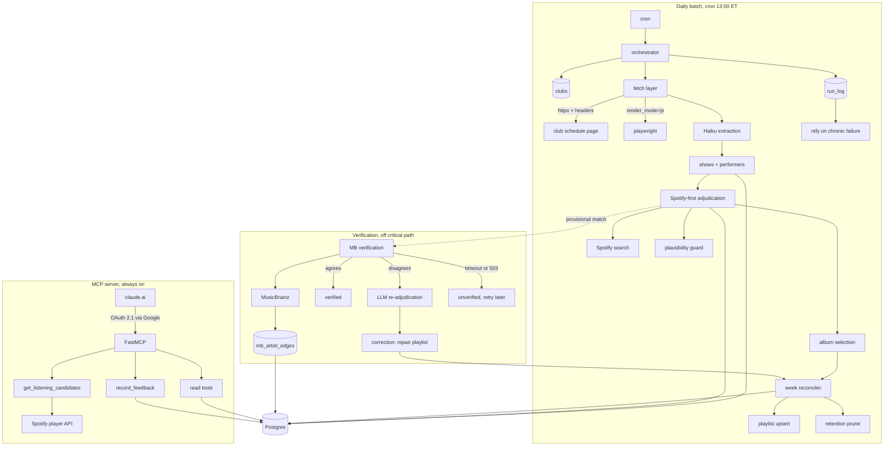

# Architecture

Technical specification for NYC Jazz Discovery. Issues reference sections of this
document by number. Where this contradicts
[the PRD](nyc-jazz-discovery-prd.md), this document wins and
[DECISIONS.md](DECISIONS.md) records why.

---

## 1. Shape of the system

Two processes, one database, no shared code path beyond the repository layer.

- **Batch pipeline** — invoked by cron once a day. Stateless and re-runnable: running it
  twice must converge on the same state, not accumulate.
- **MCP server** — long-running. Reads the log; the only thing it ever writes is feedback.



The dashed edge is the important one. Verification is triggered by adjudication but never
blocks it: a playlist is produced whether or not MusicBrainz answers. See section 6.

---

## 2. Module layout and the dependency rule

```
src/jazzdisco/
  core/            # zero I/O, pure domain logic, no third-party SDKs
    models.py         # Show, Performer, ArtistMatch, WeekPlaylist, ExtractedShow
    weeks.py          # Tuesday-Monday arithmetic (week_start_date)
    normalize.py      # act-name cleanup, ensemble-suffix stripping, set labels
    plausibility.py   # jazz-adjacency + follower/album sanity scoring
    selection.py      # album choice rule, track ordering
  ports/           # Protocols only, no implementations
    repository.py     # ClubRepo, ShowRepo, ArtistRepo, GraphRepo, FeedbackRepo, RunRepo
    fetcher.py        # Fetcher.get(url, render_mode) -> Html
    extractor.py      # Extractor.extract(text, window) -> list[ExtractedShow]
    music.py          # MusicService: search, albums, album_tracks, playlist ops, player
    graph.py          # GraphService: resolve_mbid, spotify_url_for, edges_for
    notifier.py       # Notifier.alert(msg)
  adapters/        # the only place third-party SDKs may appear
    pg/               # Postgres repositories
    http_fetcher.py
    pw_fetcher.py
    anthropic_extractor.py
    spotify.py
    musicbrainz.py
    ntfy.py
  pipeline/
    daily.py          # cron entry point
    adjudicate.py
    verify.py         # MB verification, dispute resolution, corrections
    reconcile.py
    prune.py
  mcp/
    server.py         # FastMCP + OAuthProxy
    tools_read.py
    tools_feedback.py
    render_instructions.py
  config.py          # all env reads happen here and nowhere else
```

**The dependency rule:** `core/` and `ports/` must never import `adapters/`, and `core/`
must never perform I/O. This is what satisfies PRD 8.6 — it means the business logic can
run under cron, under a different scheduler, or on different hardware without change.
It is enforced by an `import-linter` contract in CI, not by good intentions.

Corollary: `config.py` is the only module that reads the environment. Adapters receive
their configuration as constructor arguments.

---

## 3. Club configuration

A `clubs` table, edited directly with `psql` or any DB client. No admin UI, and adding a
club never requires a code change or a deploy — this is only true because extraction is
LLM-based (section 5).

| Column | Purpose |
|---|---|
| `club_id` | Slug, e.g. `village-vanguard` |
| `name` | Display name used in playlist titles |
| `schedule_url` | Page to fetch |
| `render_mode` | `http` (default) or `js` |
| `week_start_dow` | ISO weekday the booking week starts. Default `2` (Tuesday) |
| `timezone` | Default `America/New_York` |
| `active` | Excluded from runs when false |
| `notes` | Free text for quirks worth remembering |

**Seeded URLs must be verified, not assumed.** During architecture work two plausible club
domains failed DNS resolution outright. Seeding a club is not done until its URL has been
fetched successfully once.

---

## 4. Fetch layer

Default path is `httpx` with a realistic browser header set — `User-Agent`, `Accept`,
`Accept-Language`. This is not optional politeness: Birdland returns `403 Forbidden` to a
bare request. Evidence in [DECISIONS.md](DECISIONS.md) ADR-004.

`render_mode: js` on a club routes it through Playwright/Chromium instead. No club needs
this today; the flag exists so that one that does is a config change.

Rules:

- Check and respect `robots.txt` before fetching.
- One request per club per run. This is a polite visit, not a crawl.
- Retry transient failures (timeouts, 5xx, 429) with exponential backoff; a persistent
  failure is recorded against that club and does not affect any other club.
- Convert HTML to text with `trafilatura` before extraction, so the model sees prose
  rather than markup and the token cost stays small.

---

## 5. Extraction

One Anthropic Claude Haiku call per club per run, with a strict JSON schema, over a
**horizon** of today through `HORIZON_WEEKS_AHEAD` weeks. Clubs publish weeks in advance,
so a single fetch populates future weeks as well as the current one.

Extracted per event:

| Field | Notes |
|---|---|
| `show_date` | ISO date, as labelled by the club. No reinterpretation. |
| `act_name` | Headline act as listed |
| `set_times[]` | Published set times where available; may be empty |
| `performers[]` | `{name, instrument}` for every musician named |
| `album_mentioned` | Album title if the listing names one |
| `raw_text` | The listing text the extraction came from, for audit and search |

**`performers[]` is not optional.** Jazz listings name the whole band with instruments —
Village Vanguard's page reads *"Bill Frisell – Guitar, Greg Tardy – Saxophone, Gerald
Clayton – Piano"*. This is the only substrate for the taste graph that cannot be
backfilled later: an unrecorded week is gone. It costs nothing extra on a call already
being made.

**Dates are taken as the club labels them.** A 00:30 set listed under Friday stays Friday.
Re-deriving a "true" date invites off-by-one bugs and disagrees with the venue's own
calendar.

---

## 6. Matching: Spotify-first, MusicBrainz-verified

The ordering matters and is the most consequential decision in the system. MusicBrainz
cannot supply playable tracks, so Spotify must be consulted regardless; querying
MusicBrainz first would add a call and a failure mode without removing either. So Spotify
resolves, and MusicBrainz only ever confirms or disputes.

### Stage 1 — normalize (no network)

Strip set labels, ticket and price text, and ensemble suffixes (`Trio`, `Quartet`,
`Quintet`, `Four`, `Legacy Trio`, `and Friends`) to recover the bandleader name. Keep the
original as `act_name_raw`.

### Stage 2 — Spotify search

Up to 10 candidates with `genres`, `popularity`, and `followers`.

### Stage 3 — plausibility guard (no network)

`core/plausibility.py` scores each candidate on whether it could plausibly be a working
jazz act: jazz-adjacent genre tags present, follower count and album count mutually
consistent, not an obvious hobbyist or a same-named act from an unrelated genre.

This is the primary defence against wrong-genre albums, **not** MusicBrainz. It runs on
data already in the search response, costs nothing, and — critically — works when
MusicBrainz is unreachable, which is exactly when a guard is most needed.

### Stage 4 — LLM adjudication

Haiku sees the raw listing text and the surviving candidates, returning
`{artist_id | null, confidence, reasoning}`.

| Confidence | Outcome |
|---|---|
| `>= 0.80` | Accept |
| `0.50 – 0.79` | Accept, flag `needs_review` |
| `< 0.50` | `NO_CONFIDENT_MATCH`; no music added, logged for manual follow-up |

The bar is deliberately conservative: with one full album per artist, a wrong match costs
45 minutes of irrelevant music rather than three stray tracks. A logged miss is a useful
signal; a wrong album is pollution.

**Stages 1–4 alone produce a complete, correct playlist.** Everything below is
verification.

### Stage 5 — MusicBrainz verification (off critical path)

Hard 2-second timeout, 1 request/second, permanently cached. Uses the Spotify artist URL
that MusicBrainz stores against an MBID, giving a genuinely independent comparison rather
than a second fuzzy name match.

| MusicBrainz result | `verification_state` | Effect |
|---|---|---|
| MBID found, `spotify_url` matches | `verified` | Confidence raised to ceiling |
| MBID found, `spotify_url` differs | `disputed` | Stage 6 runs |
| MBID found, no `spotify_url` stored | `unverifiable` | Stays provisional; MB type and tags used as soft signal |
| No MBID hit | `unverified` | Negative-cached for `MUSICBRAINZ_MISS_TTL_DAYS`, then retried |
| Timeout or 5xx | `unverified` | **Run continues untouched**; retried next day |

Cache policy: hits are permanent (the data barely changes); misses expire after 30 days so
a newly-added artist is eventually picked up without daily re-querying.

### Stage 6 — dispute resolution

Fires only on `disputed`. One Haiku call sees both candidates plus MusicBrainz's entity
type, tags, and membership edges, and returns a winner or `none` (which downgrades to a
logged miss). Reasoning is persisted to `artists.match_notes` so any correction is
auditable months later.

MusicBrainz is not automatically treated as authoritative: its Spotify links are
human-curated but can be stale, and can point at a band where the person was wanted.

### Stage 7 — correction

If resolution changes the artist and tracks are already live, the reconciler removes the
wrong album and adds the right one, writing a `playlist_events` row for each removal and
addition. **This is the only circumstance in which a live playlist shrinks.**

### Escape hatch (documented, not built)

If MusicBrainz reliability becomes a genuine problem, it publishes full database dumps and
a `musicbrainz-docker` self-hosting path. Overkill at roughly six artists per day, but
recorded so the option is known rather than rediscovered.

---

## 7. Album selection

One full album per artist, in track order. Albums are composed sequences; scattering top
tracks across them is the worse listen, and for jazz it obscures the record entirely.

1. `artist_albums(include_groups='album')` — excludes singles, compilations, and
   `appears_on` sideman credits. Without this filter you get greatest-hits packages and
   other people's records, which for working jazz musicians is the common case.
2. Reject compilations, greatest-hits, and obvious reissues by title heuristic.
3. Sort by `album.popularity` descending. **Spotify exposes no album ratings** —
   `popularity` (0–100) is the closest available field.
4. If the top album scores below 5, fall back to most recent `release_date`. Working
   musicians frequently have no album with meaningful popularity.
5. `album_tracks`, ordered by `track_number`.

---

## 8. Week reconciler

The week is **Tuesday–Monday**, matching how clubs actually book: Village Vanguard runs
Tuesday through Sunday, so a Monday-start week would split bookings across two playlists.
The key is `week_start_date` (the Tuesday's date), not an ISO week number.

1. Group resolved artists by `(club_id, week_start_date)`.
2. Dedupe by `spotify_artist_id`, falling back to normalized name slug for unmatched acts.
   An artist playing Tuesday through Sunday contributes **one** album.
3. Compute the desired track list, ordered by first appearance in the week.
4. Diff against the live playlist and apply additions. Removals only via stage 7.
5. Title: `This Week at {Club} - {Mon DD}-{Mon DD}`. Description lists artists in
   chronological night order, so the week is legible without opening the playlist.

**Idempotency falls out of this by construction.** The key is deterministic and the
operation is a diff, so re-running converges rather than duplicating. This satisfies
PRD 8.3 structurally rather than by defensive coding.

---

## 9. Retention

Keep `week_start_date` within `[current_week - RETAIN_WEEKS_PAST, current_week +
HORIZON_WEEKS_AHEAD]` — six live playlists per club by default.

Outside that window, unfollow and stamp `spotify_removed_at`.

Two things to be precise about:

- **Spotify has no delete-playlist endpoint.** The only available operation is
  `DELETE /v1/playlists/{id}/followers`, which removes it from the library while the
  playlist continues to exist at its URI. The PRD's "deleted" is unfollow.
- **The log is never pruned.** Removing a playlist from Spotify must never affect its row.
  Spotify holds the audio; the database holds the history.

---

## 10. Orchestration, failure isolation, alerting

Cron fires `pipeline.daily` at `RUN_HOUR_ET` (default 13:00 ET) — early enough that the
week's music is present well before doors, late enough to catch same-day changes.

- Each club runs inside its own `try`/`except` and writes its own `run_log` row. One club's
  site being down, redesigned, or 403-ing must never prevent the others from being built.
- Outcomes: `success`, `no_shows`, `fetch_fail`, `extract_fail`, `no_match`, `partial`.
- **Chronic failure** — three consecutive failures for the same club — fires one `ntfy`
  push, then suppresses until that club succeeds again. Ordinary single-day failures are
  logged and queryable but do not push.

This resolves a contradiction in the PRD, which requires failures to be "visible to the
user, not silent" (SC7, FR8) while placing all notifications out of scope. Everything is
queryable via `get_run_health`; only the case you cannot afford to miss pushes.

---

## 11. MCP server

FastMCP with `OAuthProxy` delegating login to Google, allow-listing a single email. Caddy
terminates TLS on a subdomain.

**Why not the PRD's static access token:** claude.ai and Claude Desktop custom connectors
require OAuth 2.1 with dynamic client registration and reject static bearer tokens.
FastMCP's OAuth Proxy supplies the DCR and metadata endpoints while Google performs the
actual authentication, so no authorization-server code is written here. Access control is
enforced by Google plus an email allow-list, not by a shared secret in a config file.

### Read tools

| Tool | Purpose |
|---|---|
| `search_shows(query, club?, date_from?, date_to?)` | Structured and fuzzy show lookup |
| `whats_playing_at(club, date)` | "What played at the Vanguard on the 3rd" |
| `search_notes(query)` | Free text over notes and listings (`tsvector` + `pg_trgm`) |
| `recent_feedback(sentiment?, limit?)` | "What have I liked lately" |
| `artist_profile(artist)` | Genres, MB tags, instruments, groups, collaborators, your feedback — one call |
| `artist_connections(artist, depth?)` | Traverses `mb_artist_edges` plus co-performance |
| `get_run_health(days?)` | Per-club outcomes; how the pipeline is doing |

Responses are small and conversational — a handful of rows with enough detail to answer,
never a dump of the log.

### Feedback, as two tools

Feedback arrives as "I really liked that one", which is not a resolved reference. Rather
than have the model guess, resolution is explicit:

- **`get_listening_candidates()`** — read-only. Returns currently-playing (if any) plus the
  last ~10 recently-played tracks, each joined to the log with club and week provenance.
  Anything not found in the log is returned and flagged, not silently dropped.
- **`record_feedback(target_type, target_id, sentiment, note?)`** — write. Rejects anything
  but an explicit resolved target.

`target_type` is `artist`, `track`, or `album`. **Never the weekly playlist**: a weekly
playlist holds several bands and many hours of music, so sentiment attached to it says
nothing. This departs from PRD FR9, which scoped notes to `playlist_record_id`, and the
departure follows directly from weekly playlists.

The write surface is deliberately this narrow. Even with valid credentials there is no path
from the MCP server to club config, playlists, or the pipeline. Containment is a security
property worth preserving as the system grows.

---

## 12. The taste graph

The point of the log is not recall, it is accumulation. Two edge sets, from different
sources, with complementary coverage:

- **Co-performance** — `show_performers` self-joined on `show_id`. Everyone who shared a
  bandstand at your clubs, *including* sidemen too obscure for MusicBrainz.
- **Recorded relationships** — `mb_artist_edges`, carrying `member of band`,
  `collaboration`, and `parent`, with instrument attributes and date ranges. A musician's
  whole recorded history, well beyond the venues you happen to watch.

Neither alone is sufficient: MusicBrainz is thin on young players with no discography, and
club listings know nothing about records made before you started watching. Together they
cover the field.

**What the graph can answer well:** which groups a musician has been in and when, who they
have played with, which of those people you have already liked, which instruments and
genres recur in what you like.

**What it cannot answer, and why:** there is no acoustic description of anything.
`audio-features` and `audio-analysis` are gone. Style questions are answered from genre
tags (coarse), your own notes (precise but sparse), and Claude's own knowledge of the
musician (rich but not grounded in your data). The graph's contribution to a style question
is disambiguation and provenance — pinning down *which* musician is meant and what they
verifiably played on — not description. Lineage is itself a real stylistic signal in jazz.

`artists.style_embedding` (`pgvector`) exists in the schema and is left null in v1, so
similarity search over notes and genres is a later feature rather than a later migration.

---

## 13. Non-functional requirements

**Hosting.** One small always-on Linux VPS. Docker Compose runs Postgres 17 and the MCP
server; host cron invokes the batch job. Chosen over AWS serverless because half the system
is a persistent session-oriented server, which Lambda fits poorly.

**Secrets.** `.env`, mode `600`, read only through `config.py`. Never in code, never
committed. `.env.example` documents every variable.

**Backups.** Nightly `pg_dump` to `/var/backups`, retained 30 days. The log is the
irreplaceable asset — playlists can be rebuilt, a year of accumulated taste signal cannot.

**Reliability.** Idempotent by construction (section 8). Transient failures retry with
backoff before being recorded as hard failures.

**Observability.** `run_log` answers, at a glance: did last night's run succeed, which
clubs failed, and is any club chronically broken. Surfaced via `get_run_health`.

**Scraping conduct.** Six public schedule pages, one polite request each per day, for
personal use, with no redistribution. `robots.txt` respected. This is not a scaled data
product and should not become one.

**Portability.** Section 2's dependency rule is the whole of it. Business logic holds no
provider SDK calls, storage sits behind Protocols, and the scheduler is a thin wrapper —
so moving to different hardware is a deployment change, not a rewrite.
