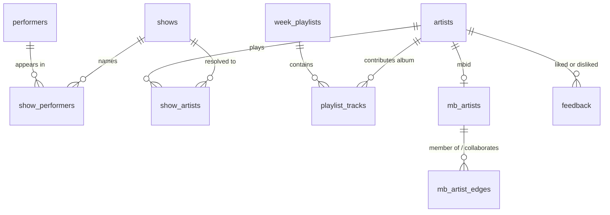

# Data Model

Schema is in [`migrations/0001_init.sql`](../migrations/0001_init.sql). This document covers
why it looks like this, and the queries that make the taste graph useful.

> **Not yet verified by execution.** The DDL has not been applied against a live Postgres
> (Docker was unavailable during authoring). A clean apply is an acceptance criterion on
> issue #1. Watch `COMMENT ON CONSTRAINT`, which is valid Postgres but unconfirmed here.

---

## 1. Three kinds of table

**Config** — `clubs`. Hand-edited. The only table a human routinely writes.

**Log** — `shows`, `performers`, `show_performers`, `artists`, `show_artists`,
`match_misses`, `week_playlists`, `playlist_tracks`, `playlist_events`, `feedback`,
`run_log`. Permanent. **Nothing here is ever deleted**, including rows whose Spotify
playlist has been unfollowed. Spotify holds audio; this holds history.

**Cache** — `mb_artists`, `mb_lookup_misses`, `mb_artist_edges`. Rebuildable from
MusicBrainz, but treated as durable because re-fetching is rate-limited at 1 req/s.

---

## 2. The four decisions the schema encodes

### `week_playlists (club_id, week_start_date)` is the idempotency key

`week_start_date` is the Tuesday of the booking week ([ADR-008](DECISIONS.md#adr-008)),
not an ISO week number, because clubs open new bookings on Tuesday and Village Vanguard
runs Tuesday–Sunday. A Monday-start week would split real residencies across two playlists.

Because the key is deterministic and reconciliation is a diff, re-running the pipeline
converges rather than duplicating. PRD 8.3's idempotency requirement is satisfied
structurally, not by defensive coding.

### Match quality is data, not a log line

`artists` carries `match_confidence`, `plausibility_score`, `verification_state`,
`needs_review`, and `match_notes`. This makes quality queryable:

```sql
-- Everything MusicBrainz never confirmed
SELECT name, verification_state, match_confidence, plausibility_score
FROM artists
WHERE verification_state IN ('unverified', 'unverifiable')
ORDER BY match_confidence;
```

`unverified` includes "MusicBrainz was down" and never implies the match is wrong
([ADR-006](DECISIONS.md#adr-006)).

### Misses are kept

`match_misses` retains acts that could not be resolved, with the raw name and the best
rejected guess. A logged miss is a signal worth investigating; silently skipping destroys
it.

### Feedback targets artists and tracks, never playlists

A weekly playlist holds several bands and many hours of music, so sentiment attached to it
says nothing ([ADR-014](DECISIONS.md#adr-014)). `show_id` and `week_playlist_id` are carried
as *context*, giving provenance: "liked Gerald Clayton, heard via Village Vanguard, week of
18 Aug".

---

## 3. The taste graph

Two edge sets from different sources with deliberately complementary coverage.



**Co-performance** — `show_performers` self-joined on `show_id`. Everyone who shared a
bandstand at your clubs, including sidemen with no discography at all.

**Recorded relationships** — `mb_artist_edges`, carrying `member of band`, `collaboration`,
and `parent`, with `instruments[]` and `begin_date`/`end_date`. A musician's whole recorded
history, well beyond the venues you watch.

Neither alone suffices. MusicBrainz is thin on young players; club listings know nothing
about records made before you started watching. Note that `mb_artist_edges.dst_mbid` is
deliberately **not** a foreign key — edges are discovered before the target artist has been
fetched, and requiring the target first would force a breadth-first crawl of MusicBrainz.

### What the graph answers well

```sql
-- 1. Every group a musician has been in, and when
SELECT e.dst_name, e.edge_type, e.instruments, e.begin_date, e.end_date
FROM mb_artist_edges e
JOIN mb_artists m ON m.mbid = e.src_mbid
WHERE m.name = 'Gerald Clayton'
ORDER BY e.begin_date NULLS LAST;

-- 2. Who has he actually shared a bandstand with, at your clubs
SELECT p2.name_display, sp2.instrument, count(*) AS nights
FROM show_performers sp1
JOIN performers p1  ON p1.performer_id = sp1.performer_id
JOIN show_performers sp2 ON sp2.show_id = sp1.show_id
                        AND sp2.performer_id <> sp1.performer_id
JOIN performers p2  ON p2.performer_id = sp2.performer_id
WHERE p1.name_norm = 'gerald clayton'
GROUP BY p2.name_display, sp2.instrument
ORDER BY nights DESC;

-- 3. The useful one: artists you have LIKED who have played with him
SELECT DISTINCT p2.name_display, f.sentiment, f.note_text
FROM show_performers sp1
JOIN performers p1 ON p1.performer_id = sp1.performer_id
JOIN show_performers sp2 ON sp2.show_id = sp1.show_id
                        AND sp2.performer_id <> sp1.performer_id
JOIN performers p2 ON p2.performer_id = sp2.performer_id
JOIN feedback f    ON f.target_type = 'artist'
                  AND f.target_id = p2.spotify_artist_id
WHERE p1.name_norm = 'gerald clayton'
  AND f.sentiment = 'liked';

-- 4. Which instruments do you actually respond to
SELECT sp.instrument, count(*) FILTER (WHERE f.sentiment = 'liked')    AS liked,
                              count(*) FILTER (WHERE f.sentiment = 'disliked') AS disliked
FROM feedback f
JOIN performers p        ON p.spotify_artist_id = f.target_id
JOIN show_performers sp  ON sp.performer_id = p.performer_id
WHERE f.target_type = 'artist' AND sp.instrument IS NOT NULL
GROUP BY sp.instrument
ORDER BY liked DESC;

-- 5. Which genres recur in what you like
SELECT g AS genre, count(*) AS liked_artists
FROM feedback f
JOIN artists a ON a.spotify_artist_id = f.target_id
CROSS JOIN unnest(a.genres) AS g
WHERE f.target_type = 'artist' AND f.sentiment = 'liked'
GROUP BY g
ORDER BY liked_artists DESC;

-- 6. Fuzzy recall: "who was that solo pianist last week"
SELECT s.show_date, c.name, s.act_name_raw, f.note_text
FROM shows s
JOIN clubs c ON c.club_id = s.club_id
LEFT JOIN feedback f ON f.show_id = s.show_id
WHERE to_tsvector('english', coalesce(s.raw_text, '')) @@ websearch_to_tsquery('piano solo')
   OR s.act_name_raw % 'pianist'          -- pg_trgm similarity
ORDER BY s.show_date DESC
LIMIT 10;
```

Queries 1–3 are what `artist_connections` exposes; 1, 4, and 5 combined are what
`artist_profile` returns in a single call.

### What the graph cannot answer, and why

There is no acoustic description of anything in this system. Spotify's `audio-features` and
`audio-analysis` were withdrawn for new applications in November 2024, and so were
`related-artists` and `recommendations`
([ADR-005](DECISIONS.md#adr-005)). Nothing here holds tempo, key, energy, or mood.

So a question like "what is his style like" is answered from:

1. **Genre tags** — `artists.genres` and `mb_artists.tags`. Coarse: `contemporary jazz`,
   `jazz fusion`.
2. **Your notes** — `feedback.note_text`. Precise, but only where you have written them.
3. **Lineage** — the graph. In jazz, "came up through Paul Motian's groups" is a genuine
   stylistic signal, and it is derivable from `mb_artist_edges` alone.
4. **The model's own knowledge** — rich, but *not grounded in your data*.

The graph's contribution to a style question is disambiguation and provenance: it pins down
which musician is meant and what they verifiably played on, so the model reasons about the
right person rather than a same-named one. It does not supply the description.

`artists.style_embedding vector(1536)` exists and stays NULL in v1, so embedding notes and
genres for similarity search is a later feature rather than a later migration.

---

## 4. Indexing

| Index | Serves |
|---|---|
| GIN `tsvector` on `feedback.note_text` | "what have I said about melancholy piano" |
| GIN `tsvector` on `shows.raw_text` | Free-text over listings |
| GIN `pg_trgm` on `feedback.note_text` | Typo-tolerant note search |
| GIN `pg_trgm` on `performers.name_norm`, `artists.name` | Half-remembered names |
| GIN on `artists.genres` | Genre affinity rollups |
| `shows (club_id, show_date DESC)` | "what played at the Vanguard on the 3rd" |
| `show_performers (performer_id)` | Co-performance traversal |
| `mb_artist_edges (dst_mbid)`, `(edge_type)` | Reverse and typed traversal |
| Partial on `artists (needs_review) WHERE needs_review` | Small, cheap review queue |

Both `tsvector` and `pg_trgm` are indexed on notes deliberately: stemming handles
`pianist`/`piano`, trigram handles misspellings. They fail differently, and recall matters
more than index size at this volume.

---

## 5. Volume and backups

Roughly 5 shows a day across 6 clubs: ~2,000 `shows` rows a year, ~10,000
`playlist_tracks`, a few hundred `feedback`. The database will not become large, so
indexing generously costs nothing.

Nightly `pg_dump` to `/var/backups`, retained 30 days. **The log is the irreplaceable
asset.** Playlists can be rebuilt from club sites; a year of accumulated taste signal
cannot be reconstructed from anything.

---

## 6. Migration conventions

- Numbered, append-only: `0002_*.sql`, `0003_*.sql`. Never edit an applied migration.
- Every migration is wrapped in `BEGIN`/`COMMIT`.
- Applied with `psql -v ON_ERROR_STOP=1 -f`, so a partial apply fails loudly.
- Additive changes only where possible. This log is the asset; a destructive migration
  should be treated as a last resort and reviewed with that framing.
